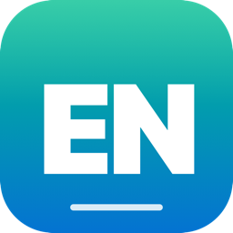

<p align="center">
  
</p>

<h1 align="center">PraticEnglish</h1>

<p align="center">
  App de barra de menu para macOS que ajuda você a praticar inglês enquanto digita em português.
</p>

<p align="center">
  
  
  
  
</p>

---

## Sumário

- [O que ele faz](#o-que-ele-faz)
- [Funcionalidades](#funcionalidades)
- [⚠️ Riscos e considerações](#️-riscos-e-considerações)
- [✅ Como usar com segurança](#-como-usar-com-segurança)
- [Como funciona internamente](#como-funciona-internamente)
- [Requisitos](#requisitos)
- [Build](#build)
- [Instalação e permissões](#instalação-e-permissões)
- [Menu da barra](#menu-da-barra)
- [Configuração](#configuração)
- [Limitações conhecidas](#limitações-conhecidas)
- [Estrutura do projeto](#estrutura-do-projeto)
- [Licença](#licença)
- [Disclaimer](#disclaimer)

---

## O que ele faz

Você está estudando inglês. Digita uma frase em português em qualquer aplicativo. O PraticEnglish detecta a frase, mostra a versão em inglês num popup flutuante, e — se você quiser — substitui o seu texto pela tradução com um atalho. A ideia é forçar você a *ver* a versão em inglês de tudo que escreve durante uma sessão de estudo, transformando atos cotidianos (escrever um e-mail, um post, uma anotação) em prática de idioma.

## Funcionalidades

| Recurso | Descrição |
|---------|-----------|
| **Detecção automática de pt-BR** | Usa `NLLanguageRecognizer` da Apple. Só dispara em texto com confiança ≥ 65% de ser português, ≥ 4 caracteres e ≥ 2 palavras. |
| **Tradução para inglês** | Via API pública gratuita da MyMemory (sem chave). Cache em memória durante a sessão evita pedir a mesma tradução duas vezes. |
| **Popup flutuante** | Aparece próximo ao campo focado (modo AX) ou ao cursor (modo buffer). Auto-dimensiona pra textos longos, com scroll quando necessário. |
| **Substituição em um atalho** | `⌥⇧⏎` substitui seu texto pela tradução. Usa `AXValue` quando disponível; fallback para `Cmd+A` + retype, ou `N×Backspace` + retype. |
| **Liga/desliga real** | `⌘⇧E` ou item do menu "Ativado". **Quando desligado, o monitor global de teclado é removido** — o app deixa de receber qualquer keystroke até ser reativado. |
| **Detecção de campo seguro** | Em apps que expõem Acessibilidade (Safari, Chrome, apps nativos), o app reconhece `AXSecureTextField` e ignora silenciosamente. Inclusive aborta substituição se o foco mudar para um campo seguro entre o popup e a confirmação. |
| **Funciona em apps sem AX** | VS Code, Cursor, Slack, Terminal — modo buffer reconstrói o texto a partir dos keystrokes recebidos quando a Acessibilidade não expõe nada. |
| **Log com redação por padrão** | O conteúdo do texto digitado **não é gravado** no log; só metadados (contagem de palavras/caracteres). Modo verboso opcional para debug. |
| **Limpeza de log** | "Limpar log agora…" (com confirmação) e toggle "Limpar log ao iniciar" para apagar o log automaticamente em cada launch. |
| **Ícone na barra de menu** | Sem ícone no Dock (`LSUIElement`). Indicadores visuais do estado: `EN`, `EN·off`, `EN⚠︎AX`, `EN⚠︎IM`. |

---

## ⚠️ Riscos e considerações

Por design, este app **monitora globalmente o teclado** quando ativado e **envia trechos do que você digita para um servidor de terceiros**. Os riscos abaixo são reais — leia antes de usar.

### Privacidade

- **O texto identificado como pt-BR (≥ 4 chars, ≥ 2 palavras) é enviado para a API pública MyMemory** (`api.mymemory.translated.net`) por HTTPS. A MyMemory pode logar requisições e usar os textos para melhorar seu sistema. Ver [Termos de Uso da MyMemory](https://mymemory.translated.net/doc/usagelimits.php).
- **O log local** (`~/Library/Logs/PraticEnglish.log`) é texto plano, sem criptografia, criado com permissões `0600` (somente o seu usuário lê — protege contra outras contas e backups que respeitam permissão POSIX, mas **não** contra outros processos rodando na sua mesma sessão de usuário). Por padrão guarda só metadados; se você ligar o modo verboso, o conteúdo aparece. Use as opções de limpeza no menu para zerá-lo.

### Captura de senhas

- Em apps que expõem Acessibilidade, o app **detecta `AXSecureTextField` e ignora**.
- Em apps que **não expõem Acessibilidade** (Electron, terminais, alguns campos web), **não há como saber se o campo é de senha**. Se você digitar uma senha de ≥ 2 palavras enquanto o app está ativo, o buffer interno pode capturá-la — e em casos limite até enviá-la à API.
- O log nunca grava esses keystrokes em texto claro, mas o buffer fica em memória.

### Substituição inadvertida

- Se você aceita o popup (`⌥⇧⏎`) mas o foco mudou para outro campo nesse intervalo, o app pode digitar a tradução **no campo errado**.
- Em campos seguros, o caminho de substituição via buffer é bloqueado por uma verificação extra antes de enviar backspaces.

### Comportamento global do teclado

- Quando ativado, o app instala um monitor global via `NSEvent.addGlobalMonitorForEvents`. O macOS exige a permissão **Monitoramento de Entrada** para isso. Esse monitor **observa** todas as teclas — ele não as consome, ou seja, não interfere com o app que tem foco.
- Quando **desativado**, esse monitor é removido e o app não recebe mais nenhum keystroke.

### Limites de uso da API

- A MyMemory tem cota diária gratuita por IP (≈ 5000 palavras/dia para usuários anônimos, 50000 com e-mail registrado). Uso intenso pode ser bloqueado temporariamente; a tradução simplesmente vai parar de funcionar até o reset (24h após a primeira requisição). O app loga "MyMemory: cota excedida" quando isso acontece.
- Para uso pesado, troque o provedor em [`Sources/PraticEnglish/TranslationService.swift`](Sources/PraticEnglish/TranslationService.swift) por DeepL/Google/OpenAI com chave própria.

### Confiabilidade da tradução

- A tradução é automática. **Não use as sugestões em contextos onde a precisão é crítica** (jurídico, médico, técnico-formal). Para estudo, é ótima; para produção, revise.

---

## ✅ Como usar com segurança

A regra de ouro é simples: **trate o PraticEnglish como uma ferramenta que você liga *durante* uma sessão de estudo de inglês e desliga *depois***. Não deixe ligado o dia todo.

### Boas práticas

1. **Ative só durante a sessão de estudo.** Antes de começar a estudar, abra o menu **EN·off** → **Ativado** (`⌘⇧E`). Quando terminar, desative imediatamente. O badge muda para `EN·off` e o monitor global é desinstalado.

2. **Escolha o app de estudo de propósito.** Use Notes, TextEdit, um Google Docs num navegador, ou um app de notas — ambientes onde você sabe que vai estar treinando, não trabalhando com dados sensíveis.

3. **Nunca digite senhas com o app ativo.** Se precisar entrar em algum lugar (banco, e-mail corporativo, gestor de senhas), **desative antes**. O detector de campo seguro funciona na maioria dos casos, mas não em todos os apps.

4. **Evite usar com mensageiros de trabalho.** Slack, Teams, Discord, e WhatsApp Web podem conter conversas confidenciais. Mesmo que você só queira praticar uma frase casual, o resto da sua digitação pode entrar no buffer interno até a próxima troca de app. Se for usar, mantenha a janela de estudo separada da de trabalho.

5. **Não trabalhe com código sensível.** Se está num repositório com tokens, secrets ou credenciais, mantenha o app **desativado**. Vale para qualquer terminal aberto também.

6. **Revise as traduções antes de aceitar.** A tradução automática erra — especialmente em gírias, ironia, contexto profissional específico. Use o popup como ponto de partida, não como verdade absoluta. Se a tradução estiver errada, descarte e tente reformular sua frase em pt-BR de forma mais clara.

7. **Limpe o log regularmente.** Mesmo com redação ativa, o log guarda metadados (timestamps, contagem de chars, apps frontmost). Recomendado: ative **"Limpar log ao iniciar"** no menu — o log é zerado automaticamente em cada launch do app. Para limpeza pontual, use **"Limpar log agora…"**.

8. **Saia do app quando o computador for compartilhado.** Antes de emprestar a máquina, **⌘Q** no menu do app, ou desative no mínimo.

### Fluxo recomendado de uma sessão de estudo

```
1. Abro o Notes (ou outro app de estudo).
2. Clique em EN·off na barra de menu → Ativado.
3. Começo a digitar minhas frases em português.
4. Para cada popup que aparecer:
   - Leio a tradução em inglês.
   - Comparo com o que eu produziria em inglês.
   - Aceito (⌥⇧⏎) só se quiser estudar a forma sugerida.
   - Caso contrário, ignoro (qualquer outra tecla).
5. Termino a sessão.
6. Clique em EN na barra de menu → Ativado (volta a ser EN·off).
7. Continuo o resto do dia normalmente — o app não monitora mais nada.
```

### Quando NÃO usar

- Lendo/respondendo e-mails de trabalho com dados de clientes.
- Em chats de família, dependendo do nível de privacidade que você quer.
- Em qualquer fluxo de autenticação (banco, login, 2FA, recuperação de senha).
- Em apps de saúde, financeiros ou jurídicos.
- Em sessões de pair programming com código proprietário.

---

## Como funciona internamente

1. Você digita uma frase em qualquer app.
2. Após uma pausa (~0,9 s) ou ao terminar com `.`, `!` ou `?`, o app:
   - tenta ler o conteúdo do campo focado via **Acessibilidade do macOS**;
   - como fallback (apps que não expõem AX), usa um buffer interno reconstruído dos keystrokes recebidos.
3. Se o texto for detectado como pt-BR (`NLLanguageRecognizer`), a tradução é solicitada à API.
4. Um popup flutuante aparece próximo ao campo (ou ao cursor, no modo buffer) com a sugestão.
5. Você pode:
   - **`⌥⇧⏎`** — aceitar e substituir (via `AXValue`, ou `Cmd+A` + retype, ou `N×Backspace` + retype);
   - **clicar Substituir** — mesma coisa;
   - **qualquer outra tecla** — descarta o popup;
   - **ignorar** — o popup some sozinho após 20 s.

## Requisitos

- macOS 13.0 ou superior
- Swift 5.9+ (vem com Xcode 15 / Command Line Tools recentes)

## Build

```bash
./build.sh
```

Gera `PraticEnglish.app` na raiz do projeto. O script compila em release, monta o `.app` bundle, copia o ícone e aplica assinatura ad-hoc para o Gatekeeper aceitar.

## Instalação e permissões

```bash
open PraticEnglish.app
```

Na primeira execução, o macOS pedirá **duas permissões separadas** (ambas obrigatórias):

| Permissão | Para quê |
|-----------|----------|
| **Acessibilidade** | Ler o texto do campo focado e substituí-lo via API de Acessibilidade. |
| **Monitoramento de Entrada** | Capturar keystrokes globalmente (necessário para o debounce e o buffer interno). |

Caminhos:
- Ajustes do Sistema → Privacidade e Segurança → **Acessibilidade**
- Ajustes do Sistema → Privacidade e Segurança → **Monitoramento de Entrada**

Marque o app nas duas listas. **Após conceder, encerre e abra o app de novo** (as permissões só passam a valer no próximo lançamento).

O ícone na barra de menu reflete o estado:
- `EN` — ativo, tudo ok
- `EN·off` — desativado pelo usuário (monitor não instalado, sem captura)
- `EN⚠︎AX` — falta Acessibilidade
- `EN⚠︎IM` — falta Monitoramento de Entrada
- `EN⚠︎` — falta as duas

## Menu da barra

Clique no ícone **EN** na barra de menu:

| Item | Atalho | Descrição |
|------|--------|-----------|
| **Ativado** | `⌘⇧E` | Liga/desliga o monitoramento. **Quando desativado**, remove o monitor global de teclado, zera o buffer, fecha qualquer popup e não envia nada à API. |
| **Testar agora** | `⌘⇧T` | Força a leitura do campo focado e pede sugestão (sem precisar digitar). Útil para depurar AX. |
| **Abrir Acessibilidade…** | — | Atalho para Ajustes do Sistema → Privacidade → Acessibilidade. |
| **Abrir Monitoramento de Entrada…** | — | Atalho para Ajustes do Sistema → Privacidade → Monitoramento de Entrada. |
| **Abrir log** | — | Abre `~/Library/Logs/PraticEnglish.log` no app padrão. |
| **Limpar log agora…** | — | Apaga o log local após confirmação. |
| **Limpar log ao iniciar** | — | Toggle. Quando ligado, o log é apagado automaticamente em cada launch do app. **Recomendado** para uso esporádico. |
| **Sair** | `⌘Q` | Encerra o app. |

## Configuração

### Bundle ID

O `CFBundleIdentifier` é o **identificador único do app** no macOS. Funciona como um "CPF" do app — o sistema usa pra:

| Onde | Para quê |
|------|----------|
| **Permissões de privacidade** | Acessibilidade, Input Monitoring e outras permissões de TCC são rastreadas por Bundle ID. |
| **`UserDefaults`** | Cada app tem seu próprio namespace (`defaults read <bundle-id>`). |
| **Notarização e App Store** | A Apple exige unicidade global. |
| **Launch Services** | Decide qual app abre cada arquivo/URL. |
| **Crash reports / logs do sistema** | A Apple agrupa relatórios pelo Bundle ID. |

**Convenção universal**: notação DNS reversa.

- Sem domínio próprio: `io.github.<seu-usuario>.PraticEnglish`
- Com domínio próprio: `com.seudominio.PraticEnglish`

O valor atual em [`App/Info.plist`](App/Info.plist) é `io.github.wenderson-oscar.PraticEnglish`. Se você fizer fork, troque para o seu identificador antes de compilar.

> ⚠️ **Atenção ao trocar o Bundle ID de um app já em uso**: o macOS rastreia permissões e dados em `UserDefaults` pelo Bundle ID. Trocar invalida tudo isso — você precisará:
> - Remover o app antigo das listas em **Ajustes do Sistema → Privacidade e Segurança → Acessibilidade** e **Monitoramento de Entrada**
> - Adicionar o app novo nessas mesmas listas após o primeiro launch
> - Reconfigurar preferências (estado "Ativado", "Limpar log ao iniciar", etc.)

### Logging detalhado

Por padrão, o conteúdo do texto digitado **não é gravado** no log — só metadados (contagem de palavras/caracteres). Para depuração local, defina a variável de ambiente `PRATICENGLISH_VERBOSE=1` **antes de lançar o app**:

```bash
PRATICENGLISH_VERBOSE=1 PraticEnglish.app/Contents/MacOS/PraticEnglish
```

A variável é lida uma única vez na inicialização e congelada para o resto da sessão. Para desligar, encerre o app e relance sem a variável.

> **Por que ENV var em vez de `defaults write`?** `defaults` é silencioso e qualquer processo na sua sessão de usuário pode flipar a flag por trás, sem deixar traço. Exigir variável de ambiente no launch torna ligar verbose logging uma ação deliberada por sessão — outro processo na máquina não consegue habilitar sem reiniciar o app com ENV controlada.

### Limpar log

Pelo menu do app: **Limpar log agora…** (pontual) ou **Limpar log ao iniciar** (automático em cada relaunch).

Pelo terminal:

```bash
rm ~/Library/Logs/PraticEnglish.log
```

### Trocar provedor de tradução

A MyMemory é gratuita mas tem limites. Para uso intenso, edite [`Sources/PraticEnglish/TranslationService.swift`](Sources/PraticEnglish/TranslationService.swift) e substitua o `endpoint` e a forma de parsing pelo provedor que você preferir (DeepL, Google Translate, OpenAI, Anthropic via Claude, etc.). Não esqueça de gerenciar a chave de API de forma segura — preferencialmente via Keychain ou variável de ambiente, **nunca hardcoded**.

## Limitações conhecidas

- **VS Code, Slack, Discord, Cursor** e outros Electron não expõem o conteúdo do editor via Acessibilidade por padrão. O app cai no modo buffer, que tem mais quirks (popup posicionado pelo cursor do mouse, não pelo caret; substituição por backspace simulado).
- **Terminal / iTerm2** funciona via buffer, mas a substituição por backspace pode ter efeitos colaterais em modos de aplicação (vim, REPLs).
- O detector de campo seguro (`AXSecureTextField`) só funciona se o app frontmost expuser AX. Em Electron sem AX, prefira **desativar o app** ao digitar senhas.
- O monitor `NSEvent.addGlobalMonitorForEvents` apenas observa eventos — não os consome. O atalho `⌥⇧⏎` para aceitar é processado em paralelo ao app focado, então em alguns casos o app de destino pode também receber a combinação.

## Estrutura do projeto

```
.
├── Package.swift                            # Swift Package Manager
├── App/
│   ├── Info.plist                           # Bundle metadata (LSUIElement)
│   └── Icon.icns                            # Ícone do app (gerado por tools/build-icon.sh)
├── assets/
│   └── icon.png                             # 256×256 para o README
├── tools/
│   ├── make-icon.swift                      # Renderiza a logo via Core Graphics
│   └── build-icon.sh                        # Gera Icon.icns em todas as resoluções
├── build.sh                                 # Compila e empacota o .app
└── Sources/PraticEnglish/
    ├── App.swift                            # @main entrypoint
    ├── AppDelegate.swift                    # Status bar + orquestração do menu
    ├── KeyboardMonitor.swift                # Monitor global de teclado + buffer interno
    ├── AccessibilityHelper.swift            # Leitura/substituição via AX e CGEvent
    ├── LanguageDetector.swift               # NLLanguageRecognizer
    ├── TranslationService.swift             # Cliente da API MyMemory
    ├── SuggestionPopup.swift                # NSPanel flutuante com a sugestão
    ├── Permissions.swift                    # Checks de Acessibilidade e Input Monitoring
    └── Logger.swift                         # Log com redact() e clear()
```

### Regenerar a logo

A logo é renderizada por código (CoreGraphics). Para alterar cores/tipografia, edite [`tools/make-icon.swift`](tools/make-icon.swift) e rode:

```bash
./tools/build-icon.sh
```

Isso atualiza `App/Icon.icns` e `assets/icon.png`.

## Licença

Distribuído sob a licença **MIT**. Veja o arquivo [LICENSE](LICENSE) para mais detalhes.

## Disclaimer

Este software é fornecido **como está**, sem garantias. Não é afiliado a Apple, MyMemory ou qualquer outra entidade citada. Use por sua conta e risco — em particular, esteja ciente de que o app monitora globalmente o teclado quando ativado e envia frases identificadas como pt-BR para um servidor de terceiros.

**O autor não se responsabiliza por uso indevido, vazamento de dados ou qualquer dano decorrente do uso deste software.**
